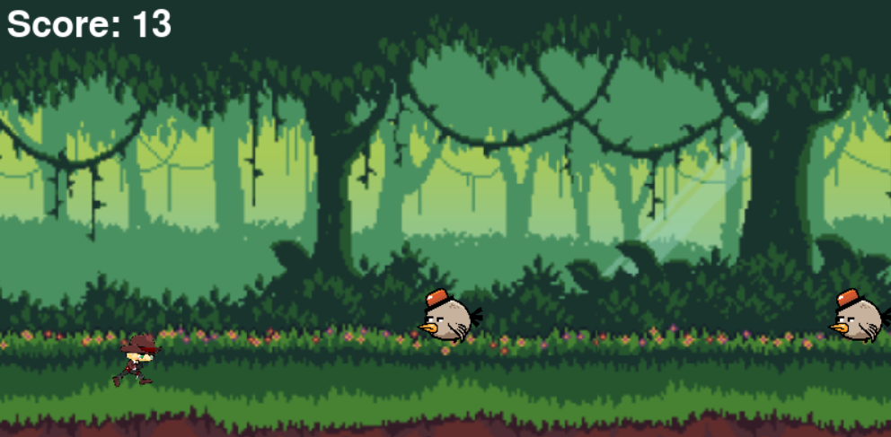

CS110
Fall Semester
Project Name: Endless Runner

Team Members: Yousef Atalla
I plan on creating a game where a person runs in the right direction endlessly until they hit an obstacle, and then the game ends.
GUI Design: I think I will have a play button in the middle of the screen for the GUI, and then a try again button once the game is over.
-Will have a start menu
-Will have a character that moves in response to inputs
-Will have obstacle collisions
-Will have a dynamic background
-Will have a game over screen

Test Case 1: Player Movement

Test Description: Verify that the player can jump and duck
Test Steps:
Start the game.
Press the down arrow key to duck
Verify that the player character gets lower
Press the jump key.
Verify that the player moves upwards before coming down
Expected Outcome: The player should be able to jump and duck.

Test Case 2: Collision Detection

Test Description: Ensure that collisions between the player and the obstacles works correctly.
Test Steps:
Start the game.
Player does not jump or duck over obstacle.
Verify that the obstacle makes contact with the player.
Player jumps over the obstacle.
Verify that no collision is detected.
Expected Outcome: Player collision should be accurate.

Test Case 3: Game Over Condition

Test Description: Confirm that the game ends when the player hits an obstacle.
Test Steps:
Start the game.
Play until the player hits an obstacle
Verify that the game displays a "Game Over" message.
Expected Outcome: The game should display a "Game Over" message when the player hits an obstacle.

Test Case 4: Menu Navigation

Test Description: Test the navigation through the game's main menu.
Test Steps:
Start the game.
Navigate through the main menu options (Start Game, try again, quit)
Verify that each option is selectable and leads to the expected actions.
Expected Outcome: The main menu should allow the player to navigate through options and select them.

Test Case 5: Error Handling

Test Description: Verify that the program handles unexpected inputs gracefully.
Test Steps:
Start the game.
Enter invalid characters or inputs during gameplay.
Verify that the program does not crash and displays appropriate error messages.
Expected Outcome: The program should handle unexpected inputs without crashing and display user-friendly error messages.

